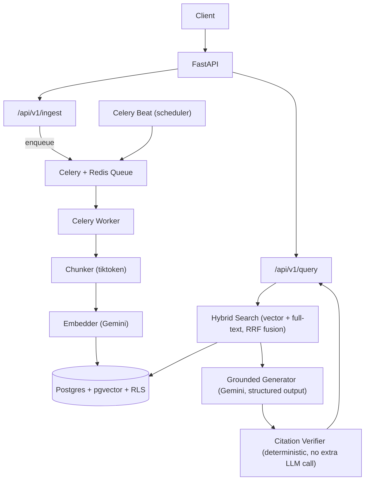

# Production-Grade RAG Pipeline

A retrieval-augmented generation system built from the ground up on **Postgres + pgvector**, **FastAPI**, and **Gemini** — with grounded answers that cite their sources and can admit when they don't know something, row-level access control enforced at the database layer, and async ingestion that never blocks a user-facing request.

This isn't a wrapper around a vector-search demo. It's a system designed the way you'd actually need to run it for real users, with real data, and more than one tenant.

---

## Why This Project

Most RAG tutorials stop at "retrieve some chunks, paste them into a prompt." That's the easy 20%. This project is about the other 80% — the parts that determine whether a RAG system is trustworthy and safe to put in front of real users:

- **Can the answer be trusted?** Every citation is verified against the actual retrieved text — not just trusted because the model said so.
- **Can the system say "I don't know"?** Retrieval confidence is measured and calibrated, not guessed, so the system abstains instead of hallucinating when it doesn't have enough context.
- **Can one user see another user's documents?** Access control is enforced by Postgres itself via Row-Level Security — not by an `if` statement in application code that's one missed code path away from a data leak.
- **Does a slow embedding call block the API?** No — ingestion runs through a Celery + Redis queue, completely decoupled from request/response latency.

---

## Architecture



Two independent pipelines sharing one database: **ingestion** is throughput-oriented and runs in the background; **query** is latency-oriented and runs synchronously behind the API. They're tuned differently on purpose.

---

## Engineering Highlights

A few decisions worth a reviewer's attention, since they're the part that doesn't show up just from reading a tech-stack list:

| Decision | Why it matters |
|---|---|
| **Access control via Postgres Row-Level Security**, not application-layer filtering | A forgotten `WHERE` clause in one code path can't leak data — the database itself refuses to return rows a user isn't authorized to see, for every query, including the vector search. |
| **Citation verification is a plain Python string check**, not a second LLM call | Deterministic, free, and catches the two most common failure modes in cited generation: a hallucinated `chunk_id` and a paraphrased quote presented as verbatim. |
| **Retrieval confidence (abstention) is calibrated against measured embedding scores**, not an assumed threshold | RRF fusion scores and raw cosine similarity are on completely different scales — conflating them is a real bug that silently breaks abstention. The threshold here is set from an actual logged measurement against this embedding model, not a guess. |
| **Ingestion is queued through Celery**, never called inline on the request path | A multi-second embedding call never holds an HTTP connection open; `task_acks_late` and bounded worker concurrency mean a crashed worker doesn't silently lose a job. |
| **Content-hash deduplication** on every document | Re-ingesting an unchanged document costs one hash comparison, not a re-embedding pass — this is what makes a scheduled re-sync job cheap to run frequently. |
| **Hybrid search via Reciprocal Rank Fusion**, not vector search alone | Pure embedding similarity misses exact keyword/entity matches (product codes, names). RRF combines vector and full-text ranking without needing their scores to be on comparable scales. |

---

## Tech Stack

- **Database:** PostgreSQL + [`pgvector`](https://github.com/pgvector/pgvector) (HNSW index, cosine similarity), Row-Level Security, generated `tsvector` column for full-text search
- **API:** FastAPI, SQLAlchemy (async) + asyncpg, connection pooling
- **LLM / Embeddings:** Google Gemini — `gemini-embedding-2` for embeddings, `gemini-3.8-flash` for grounded generation with structured JSON output
- **Async jobs:** Celery + Redis (broker, result backend, cache, rate limiting)
- **Chunking:** token-aware recursive splitting (`tiktoken`)
- **Infra:** Docker Compose for local Postgres + Redis

---

## What It Actually Does

1. **Ingest** — `POST /api/v1/ingest` accepts a document, enqueues a Celery job, and returns immediately. The worker chunks the text, embeds each chunk (batched, retried with exponential backoff), and stores it with its vector in Postgres. Unchanged documents are skipped via content-hash comparison.
2. **Query** — `POST /api/v1/query` embeds the question, runs hybrid search (vector + keyword, RRF-fused) scoped to the requesting user via RLS, and — only if retrieval confidence clears a calibrated threshold — generates a grounded answer with the model required to cite a `chunk_id` and an exact quote for every claim. Citations are verified against the real retrieved text before the answer is returned. If confidence is low or citations don't verify, the system abstains rather than guessing.
3. **Access control** — every row in `chunks` is gated by a Postgres RLS policy joined against `document_acl` and `user_group_memberships`, scoped to the authenticated user (passed via a trusted identity header in this build). Ingestion, which runs as a backend system process rather than on behalf of one user, is deliberately exempt from this policy.
4. **Scheduled maintenance** — Celery Beat fires a periodic re-sync task on a schedule, ready to be wired to a real external source connector (Confluence, S3, a CMS) to keep the knowledge base from going stale.

---

## Running It Locally

```bash
# 1. Start Postgres + Redis
docker compose up -d

# 2. Apply schema migrations
docker exec -i <db-container> psql -U rag_user -d rag_db < schema.sql
docker exec -i <db-container> psql -U rag_user -d rag_db < schema_acl.sql

# 3. Start the API
uvicorn app.main:app --reload

# 4. Start the background worker and scheduler (separate terminals)
celery -A app.celery_app worker --loglevel=info --concurrency=4
celery -A app.celery_app beat --loglevel=info
```

```bash
# Ingest a document
curl -X POST localhost:8000/api/v1/ingest/ \
  -H "Content-Type: application/json" \
  -d '{"tenant_id": "...", "source_uri": "handbook.pdf", "title": "Employee Handbook", "raw_text": "..."}'

# Ask a question, scoped to a specific user
curl -X POST localhost:8000/api/v1/query/ \
  -H "Content-Type: application/json" \
  -H "X-User-Id: <user-uuid>" \
  -d '{"query": "What is the remote work policy?"}'
```

---

## Project Structure

```
app/
├── main.py                 # app factory, lifespan, router registration
├── config.py                # pydantic-settings config (.env)
├── db.py                     # async engine, session factory, connection pool
├── celery_app.py          # Celery app, broker config, beat schedule
├── tasks.py                  # Celery tasks (ingestion, scheduled resync)
├── dependencies.py       # per-request RLS session scoping
├── routers/
│   ├── ingest.py
│   └── query.py
└── services/
    ├── chunking.py           # token-aware recursive chunking
    ├── embeddings.py       # Gemini embedding client, batching, retries
    ├── ingestion.py          # dedup check, chunk + embed + store
    ├── retrieval.py           # hybrid search (vector + full-text, RRF)
    └── generation.py       # grounded generation, citation verification,abstention
schema.sql                      # core schema: documents, chunks, HNSW index
schema_acl.sql                 # access control: groups, ACLs, RLS policy
docker-compose.yml           # local Postgres + Redis
```

---

## Known Limitations (Said Plainly, Not Hidden)

- **Not yet deployed to the cloud.** This build is complete and fully working locally; cloud deployment (AWS/GCP/etc.) is a deliberately separate scope.
- **Authentication is a placeholder.** The `X-User-Id` header stands in for real auth (JWT/session) — RLS enforcement itself is real and tested, but identity resolution isn't production-hardened yet.
- **The scheduled re-sync task is a working placeholder.** Celery Beat fires it on schedule, but it isn't wired to a real external source connector yet.
- **No reranking stage yet.** Hybrid search (vector + keyword via RRF) is implemented; a cross-encoder reranking pass on top of it is a natural next step for precision.

I'd rather list what's genuinely not done than overstate the project — happy to walk through the reasoning behind any of these in an interview.

---

## Further Reading

A full written [guide]("./docs/rag-pipeline-guide.md") covering every design decision in depth — chunking strategy, index tuning, hybrid search internals, citation verification, RLS, and scaling considerations — is included alongside this project.
