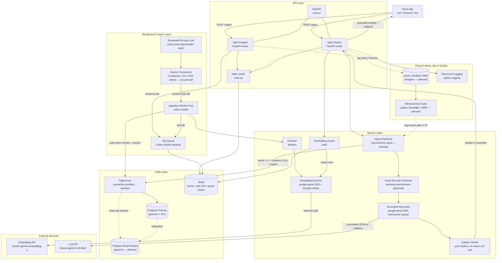

# RAG Pipeline Architecture

Architecture diagram for the production RAG pipeline (pgvector + FastAPI + Gemini + Celery). Renders natively on GitHub — paste the block below directly into your repo's `README.md`.

## Component → Tool Reference

**Built and running** (reflects the actual repo — see the main guide's table of contents for the matching section):

| Component | Tool / Library |
|---|---|
| API framework | FastAPI + Uvicorn |
| DB driver / ORM | SQLAlchemy (async) + asyncpg |
| Vector storage & search | Postgres + `pgvector` (HNSW index, cosine similarity) |
| Full-text search | Postgres `tsvector` / GIN index |
| Hybrid search fusion | Reciprocal Rank Fusion (RRF) — pure SQL |
| Access control enforcement | Postgres Row-Level Security (RLS), scoped `FOR SELECT` |
| Chunking | `tiktoken` (token-aware recursive split) |
| Embeddings | Gemini `gemini-embedding-2` via `google-genai` SDK |
| Retry logic | `tenacity` (exponential backoff) |
| Caching / rate limiting / queue broker | Redis (`redis-py`) |
| Background jobs | Celery (Redis-backed broker + result backend) |
| Grounded generation | Gemini `gemini-3.8-flash`, structured JSON output (`response_schema`) |
| Citation verification | Pure Python string matching, whitespace-normalized (no LLM call) |
| Abstention gate | Calibrated cosine-similarity threshold on top-ranked chunk |
| Observability | Python `logging` (per-query latency + citation verification results) |

**Described in the written guide, not yet built** (honest gap, not an oversight — see the guide's own "what's next" sections):

| Component | Tool / Library |
|---|---|
| Reranking | `sentence-transformers` CrossEncoder |
| Connection pooling (infra) | PgBouncer |
| Read scaling | Postgres read replica |
| Query rewriting / HyDE | An additional Gemini call to rewrite the query before embedding |
| Claim entailment check (high-stakes only) | A second Gemini call acting as a judge |
| Continuous quality gate | `pytest` + eval dataset (Recall@k, MRR) |
| Source sync connectors | Confluence / S3 / CMS clients feeding the Celery Beat placeholder task |
| Feedback capture | A `query_feedback` table for click/thumbs signal |

## Data Flow Summary

**Built and running:**
1. **Ingest path**: `Client → FastAPI → Celery Job Queue (Redis) → Worker → Chunker → Embedder (Gemini) → Postgres`
2. **Query path**: `Client → FastAPI → Hybrid Retriever (Postgres, RLS-scoped, RRF fusion) → Generator (Gemini, structured output) → Citation Verifier → abstain or answer → Client`
3. **Maintenance heartbeat**: `Celery Beat → placeholder resync task → logs that it fired` (no real source connector wired in yet)

**Planned, described in the written guide:**
4. **Full maintenance loop**: `Scheduled Syncer → Source Connectors → content-hash diff → Worker (re-embeds only changed chunks)`
5. **Quality loop**: `Query traffic → Feedback table → Eval suite → CI regression gate → back into Retriever tuning`